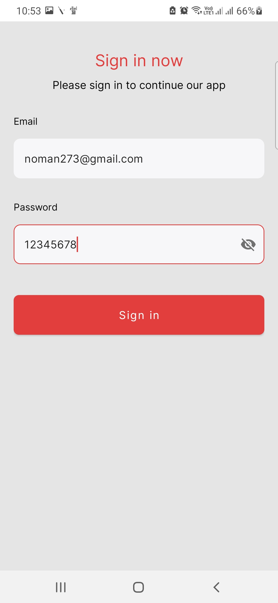
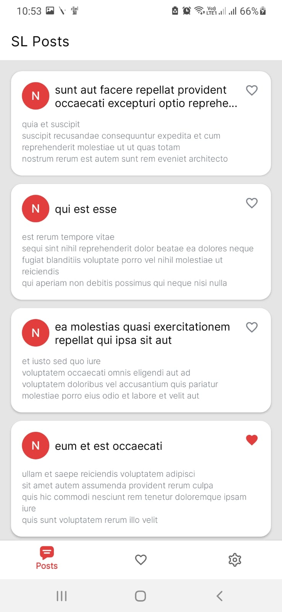
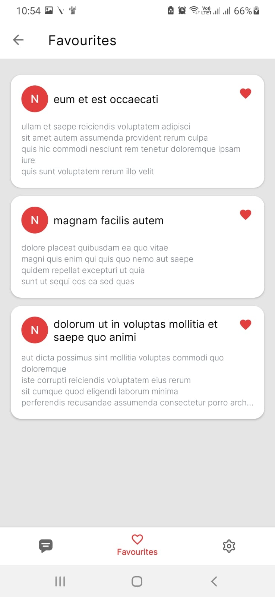
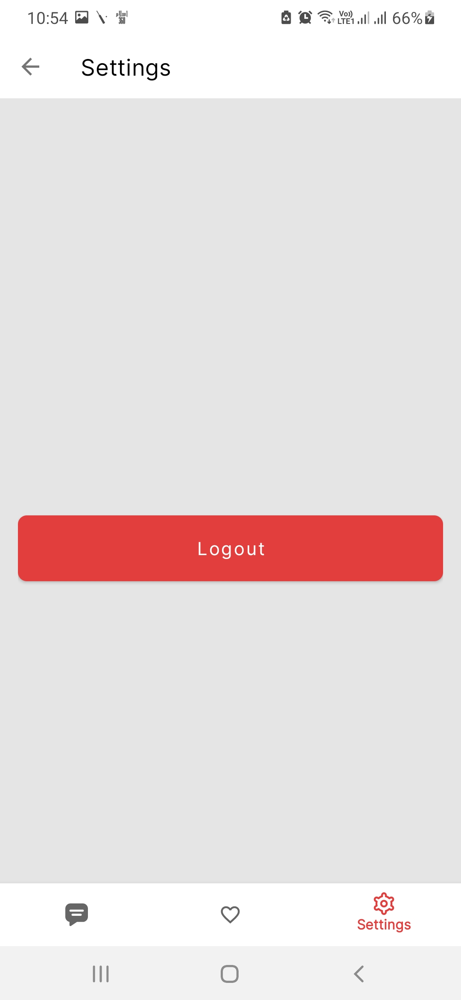

# SLPosts

A sample Android assignment project demonstrating MVVM architecture. SLPosts fetches posts from a REST API, displays them to users, and supports offline access via local database caching.

## About

SLPosts showcases:
- MVVM architecture with clean separation of concerns
- Data persistence and offline support via Room
- Network requests with Retrofit
- Dependency injection with Hilt
- Jetpack Navigation Component

## Tech Stack

**Core Technologies:**
- **Kotlin 2.2.0**
- **MVVM Architecture**
- **Kotlin Coroutines & Flows**
- **Room Database** for local storage
- **Retrofit 3** for network requests
- **Gson** for JSON parsing
- **Hilt 2.57.2** for dependency injection
- **Coil** for image loading
- **Jetpack Navigation Component 2.9.5**
- **Material Design**
- **KSP 2.2.0**

**Testing Tools:**
- **JUnit4** for unit testing
- **Coroutines Test** for coroutine-based code
- **Room Testing** for database testing
- **MockWebServer** for simulating network responses
- **MockK** for mocking
- **Robolectric** for Android component testing
- **Espresso** for UI testing

## Screenshots

 
 

## Getting Started

1. Clone the repository:
   ```bash
   git clone https://github.com/nauman-khaliq/SLPosts.git
   ```
2. Open the project in Android Studio Panda 4 (2025.3.4 Patch 1) or later.
3. Build and run the app on a device or emulator running Android API 23+.

## Requirements

- Android Studio Panda 4 | 2025.3.4 Patch 1
- Gradle 8.13
- Min SDK: 23 | Target SDK: 36
- JDK 17

## License

This project is licensed under the MIT License.
